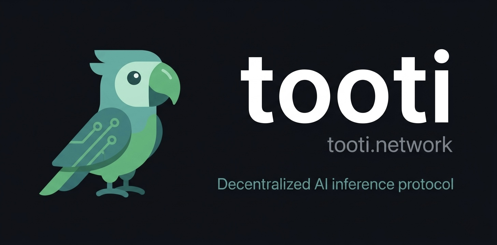
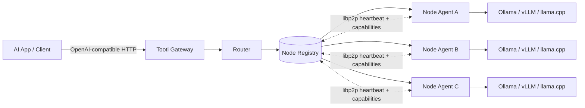

# tooti 🦜

[](#)
[](go.mod)
[](LICENSE)
[](https://discord.gg/SHuqWq87GM)



**A decentralized AI inference protocol with an OpenAI-compatible gateway.**

tooti connects model providers and application developers through a shared protocol layer:
- operators run nodes and advertise available models
- the network discovers healthy providers
- the gateway routes requests to the best available node
- clients use a familiar OpenAI-style API

## Why tooti

AI apps need reliable inference, but today teams often face:
- single-provider dependency
- regional outages and latency spikes
- limited control over routing and cost
- difficult migration paths between model backends

tooti exists to make inference **portable, resilient, and open**:
- portable for developers (standard API, minimal lock-in)
- resilient for production (multi-node discovery and failover)
- open for operators (bring your own backend: Ollama, vLLM, llama.cpp, and more)

## Architecture



### What each part does

- **Node Agent**: advertises model capabilities, health, and availability over libp2p
- **Registry + Router**: tracks live nodes and selects where each request should go
- **Gateway**: exposes `/v1/models` and `/v1/chat/completions` for client apps

## Network bootstrap

Configure `network.bootstrap_peers` (e.g. `/dnsaddr/discover.tooti.network` to expand peer ids from TXT, or a full `/ip4/.../p2p/...`).

## Quick start

### 1) Build

```bash
go build -o tooti ./cmd/tooti
```

### 2) Validate and run

```bash
# Validate config first
./tooti config-check -file ./node.yaml

# Start node
./tooti node start -file ./node.yaml

# Start gateway (same host or another host)
./tooti gateway start -file ./node.yaml
```

### 3) Test the API

```bash
# List models
curl -s http://127.0.0.1:8080/v1/models

# Stream chat completion
curl -N http://127.0.0.1:8080/v1/chat/completions \
  -H 'Content-Type: application/json' \
  -d '{"model":"llama3.2:latest","stream":true,"messages":[{"role":"user","content":"say hi"}]}'
```

## OpenClaw integration

- Guide: `docs/openclaw.md`
- Example config: `docs/openclaw.json.example`


## Contributing

See [CONTRIBUTING.md](CONTRIBUTING.md).

## License

MIT